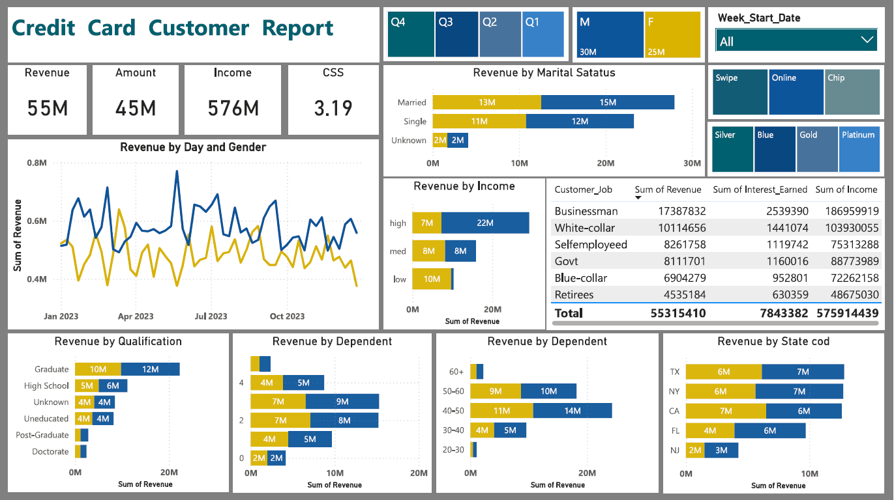
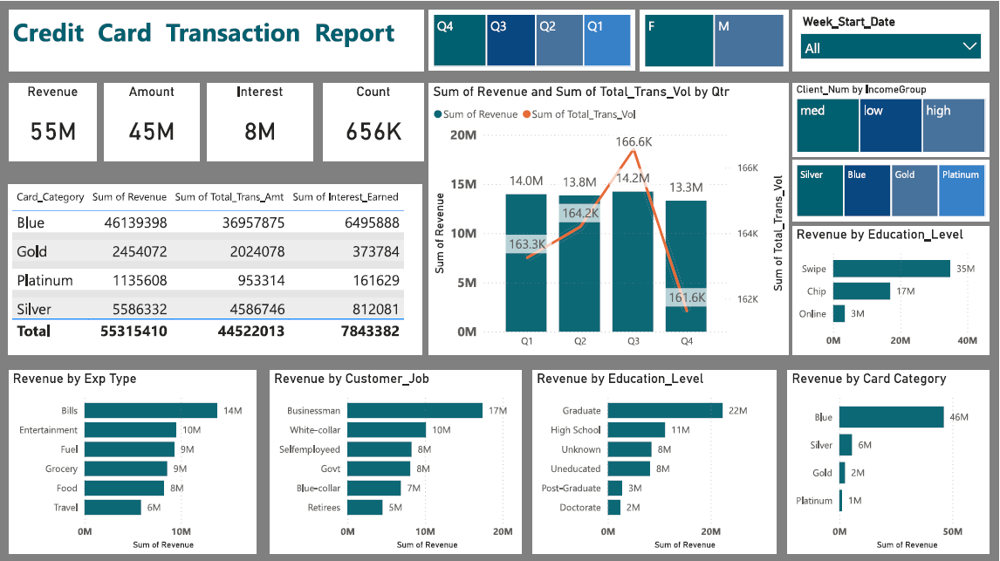

# PowerBI Project: Credit Card Financial Dashboard
## Project Overview

**Project Title**: Credit Card Financial Analytics Dashboard 
**Tool Used**: Power BI Desktop

An interactive Power BI dashboard designed to analyze credit card customer demographics, transaction behaviors, and overall financial performance. This two-page report (Customer Report & Transaction Report) provides deep insights into revenue generation, spending habits, customer segmentation, and product performance.

This analytical tool is built to deliver a comprehensive view of credit card operations, enabling stakeholders to understand who their most profitable customers are, how they spend, and which card products are driving growth.

The dashboard answers key business questions such as:  
- Which customer demographics (age, gender, marital status, job) generate the highest revenue?
- How do transaction volumes and revenues trend across different quarters?
- Which credit card categories (Blue, Silver, Gold, Platinum) are the most popular and profitable?
- What are the top expenditure types (Bills, Entertainment, Fuel, etc.) for cardholders?
- How do activation methods (Swipe, Chip, Online) compare in terms of transaction value?

This dashboard is intended for:  
- Financial Analysts & Risk Managers
- Product Managers (Credit Cards)
- Marketing & Customer Success Teams
- Banking Executives & Strategy Teams
- Data Analytics Portfolio Evaluation

## Tech Stack  
The dashboard was developed using:
- **Power BI Desktop** – Data visualization & interactive dashboard development
- **Power Query** – Data cleaning, modeling, and transformation
- **DAX (Data Analysis Expressions)** – Advanced calculations and custom KPI measures
- **Data Modeling** – Star schema relationship management for seamless filtering
- **File Format** – .pbit / .pbix

## Dataset Information  
The dataset includes detailed customer and transactional data, covering:  
- **Customer Demographics:** Age group, Gender, Marital Status, Education, Income, Job Type, Dependents, and State.
- **Financial Metrics:** Revenue, Transaction Amount, Interest Earned, Income, Customer Satisfaction Score (CSS).
- **Transaction Details:** Expenditure Type, Transaction Method (Swipe, Chip, Online), Card Category, Transaction Count/Volume.
- **Time Periods:** Week Start Date, Quarterly, and Daily trends.

## Key KPIs  
The dashboard highlights the following overarching financial metrics:  
- **$55M** – Total Revenue
- **$45M** – Total Transaction Amount
- **$576M** – Total Customer Income
- **$8M** – Total Interest Earned
- **656K** – Total Transaction Count
- **3.19** – Average Customer Satisfaction Score (CSS)

## Features & Highlights

**🔸 Business Problem**:  
Financial institutions issue multiple tiers of credit cards across a diverse customer base. Without centralized reporting, it is difficult to pinpoint which customer segments are highly profitable, which spending categories are driving transaction volumes, and whether premium card offerings (like Gold/Platinum) are justifying their presence. A holistic view is required to optimize credit limits, tailor marketing campaigns, and improve overall card adoption.

**🔸 Goal of the Dashboard**:  
To build an end-to-end financial analytics solution that:
- Segments revenue by customer demographics (Age, Gender, Marital Status, Job).
- Tracks transaction performance and identifies peak spending periods.
- Analyzes expenditure types to understand customer lifestyle and needs.
- Evaluates the performance of different card categories (Blue vs. Premium tiers).

**🔸 Walkthrough of Key Visuals**:  

***Page 1: Customer Report***
- **Revenue by Gender & Marital Status:** Male customers ($30M) edge out Female customers ($25M) in revenue generation. Married individuals contribute the highest overall share.
- **Revenue by Income & Job:** Businessmen ($17.3M) and White-collar professionals ($10.1M) in the 'High' and 'Medium' income brackets are the most valuable customer segments.
- **Revenue by Day & Gender (Line Chart):** Highlights day-to-day fluctuations in revenue, showing consistent activity with slight periodic spikes throughout the year.
- **Geographic Distribution:** Texas (TX), New York (NY), and California (CA) are the top 3 states for credit card revenue.

***Page 2: Transaction Report***
- **Card Category Performance:** The "Blue" card is the undisputed flagship product, driving a massive $46M of the total $55M revenue, followed distantly by Silver ($6M).
- **Revenue by Expenditure Type:** Customers primarily use their cards for everyday utilities and leisure, with "Bills" ($14M) and "Entertainment" ($10M) leading the chart.
- **Transaction Trends by Quarter:** Q3 saw the peak in both Revenue ($14.2M) and Total Transaction Volume (166.6K), indicating strong mid-to-late year spending, possibly tied to holidays or travel.
- **Revenue by Use Type:** Physical card usage dominates, with "Swipe" ($35M) and "Chip" ($17M) far outpacing "Online" ($3M) transactions.

## Business Insights & Impact

**📌 Core Customer Profile**:  
The ideal, high-value customer is a married, male businessman or white-collar professional with a graduate degree, likely residing in TX, NY, or CA.

**📌 Product Strategy**:  
The entry-level/standard "Blue" card is the primary revenue driver. There is a potential opportunity to upsell highly active Blue cardholders (especially those spending heavily on travel/entertainment) to Gold or Platinum tiers to increase premium segment revenue.

**📌 Digital Adoption Opportunity**:  
With "Online" transactions accounting for a very small portion of revenue compared to "Swipe/Chip", the bank could launch targeted campaigns or partnerships (e.g., e-commerce cashbacks) to boost digital spending.

**📌 Seasonal Marketing**:  
Since Q3 shows peak transaction volumes, marketing budgets and promotional offers should be heavily focused around the end of Q2 and throughout Q3 to capitalize on this natural spending surge.

## Interactive Filters  
Users can dynamically slice and dice the data using built-in slicers:
- **Quarterly Range (Q1 - Q4)**
- **Gender (M / F)**
- **Week Start Date**
- **Income Group (High, Med, Low)**
- **Card Category & Transaction Type**

## Conclusion  
This project highlights strong capabilities in financial data modeling, DAX measure creation, and dashboard UI/UX design. It transforms dense transactional databases into an intuitive, visually appealing storyboard that empowers financial decision-makers to act on empirical data rather than intuition.

## Notice
All financial figures, transaction counts, and customer demographics used in this project are synthetically generated for educational and portfolio purposes only. They do not represent actual data from any specific bank or financial institution.

## Developed By - Vijay Kumar
